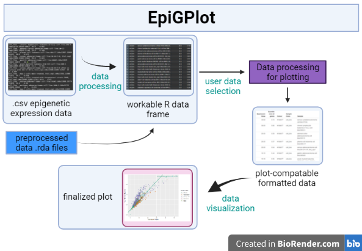

<!-- README.md is generated from README.Rmd. Please edit that file -->

```{r, include = FALSE}
knitr::opts_chunk$set(
  collapse = TRUE,
  comment = "#>",
  fig.path = "man/figures/README-",
  out.width = "100%"
)
```

# EpiGPlot

<!-- badges: start -->
<!-- badges: end -->

The goal of EpiGPlot is to plot epigenetic genes expression values into interpretable data. Main function __*plotEpigeneticEV*__ allows for specific linear regression model visualization on user-specified sample classes.

## Installation

You can install the development version of EpiGPlot like so:
``` r
require("devtools")
install_github("kevbobli224/EpiGPlot", build_vignettes = TRUE)
library("EpiGPlot")
``` 

To run the Shiny App: 
```r
EpiGPlot::runEpiGPlot()
```


## Description/Overview
The package's purpose is to plot and visualize epigenetic factor data sets into simple and interpretable visualization plots.

Established epigenetic factor databases do not have visualization methods for gene data sets, this package aims to fill and addresses the visualization gap by plotting expression values of given gene set against a range of quantile genes.

`EpiGPlot` contains 4 exported functions for users:
For plotting purposes and graphing linear regression models: __*plotEpigeneticEV*__

For customizing plotting layouts and specifications: __*layoutEpigeneticEV*__

For parsing .csv or loading .rda data for a certain gene and their expression values amongst other genes: __*parseEpigeneticData*__, __*loadEpigeneticData*__

Refer to vignette or manual for detailed usage of the provided functions. 

Function examples in the manuals are only given to the exported functions. Non-exported functions will not have an example.

An overview of the package is illustrated below.


A Shiny application could be run for the ease of visualization.
To run the Shiny App: 
```r
EpiGPlot::runEpiGPlot()
```


### Details

For more details, see vignette

To list all functions available in the package: 
``` r
ls("package:EpiGPlot")
```
To list all provided data sets in the package:
``` r
data(package="EpiGPlot")
```
A package tree structure is provided as below:
``` r
- EpiGPlot
  |- EpiGPlot.Rproj
  |- DESCRIPTION
  |- NAMESPACE
  |- LICENSE
  |- README
  |- data
    |- NO66_HUMAN.rda
  |- inst
    |- CITATION
    |- shiny-scripts
      |- app.R
    |- extdata
      |- expression.csv
      |- Plot1_default.png
      |- Plot2_spec_class.png
      |- Plot3_spec_lr.png
      |- overview.png
      |- overview_shiny.PNG
  |- man
    |- getColourMattrix.Rd
    |- getGeneClassColour.Rd
    |- layoutEpigeneticEV.Rd
    |- loadEpigeneticData.Rd
    |- NO66_HUMAN.Rd
    |- parseEpigeneticData.Rd
    |- plotEpigeneticEV.Rd
    |- pScaleRange.Rd
  |- R
    |- data.R
    |- epiGPlotFunctions.R
    |- runEpiGPlot.R
  |- vignettes
    |- EpiGPlot.Rmd
    |- EpiGPlot.R
    |- EpiGPlot.html
  |- tests
    |- testthat.R
    |- testthat
      |- test-epiGPlotFunctions.R
```
Or, refer to vignette for more details.


## Contributions
The `plotEpigeneticEV` function uses `ggplot` and `ggrepel` packages to perform plotting functions, as well as `grDevices` package for the `layoutEpigeneticEV` function to parse and validate hexadecimal colour strings. `shiny` is utilized for interactive web application for ease of package interaction.

## References for Package
* [Medvedeva, Y. A., Lennartsson, A., Ehsani, R., Kulakovskiy, I. V., Vorontsov, I. E., Panahandeh, P., Khimulya, G., Kasukawa, T., &amp; Drabløs, F. (2015). Epifactors: A comprehensive database of human epigenetic factors and complexes. Database, 2015.](https://doi.org/10.1093/database/bav067)

## Acknowledgement
This  package  was  developed  as  part  of  an  assessment  for  2021  BCB410H:  Applied  Bioinfor-matics, University of Toronto, Toronto, CANADA.


## Tutorials  
  
For tutorials and plot interpretation, refer to the vignette:

``` r
browseVignettes("EpiGPlot")
```
## Sample Outputs

```{r, echo=FALSE,out.width="49%", out.height="20%",fig.cap="Different parameters provided to the plot function.",fig.show='hold',fig.align='center'}
knitr::include_graphics(c("inst/extdata/Plot1_default.png","inst/extdata/Plot2_spec_class.png", "inst/extdata/Plot3_spec_lr.png"))
``` 

