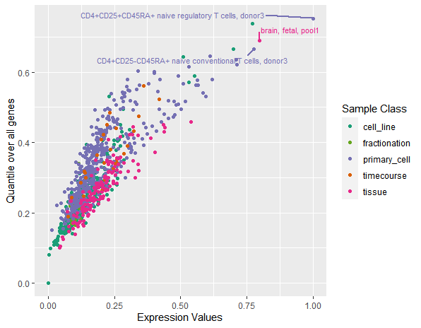
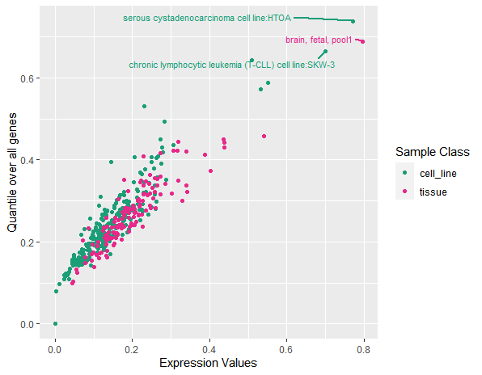
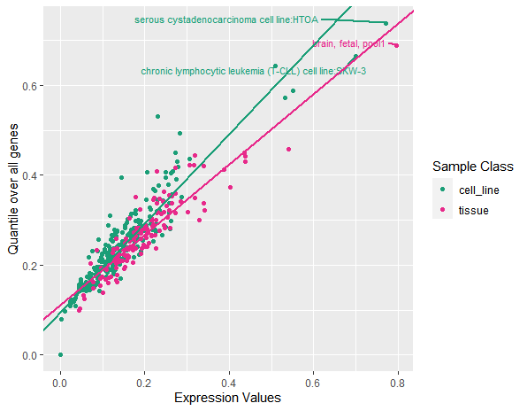

<!-- README.md is generated from README.Rmd. Please edit that file -->

# EpiGPlot

<!-- badges: start -->
<!-- badges: end -->

The goal of EpiGPlot is to plot epigenetic genes expression values into
interpretable data. Main function ***plotEpigeneticEV*** allows for
specific lienar regression model visualization on user-specfied sample
classes.

## Installation

You can install the development version of EpiGPlot like so:

``` r
require("devtools")
install_github("kevbobli224/EpiGPlot", build_vignettes = TRUE)
library("EpiGPlot")
```

## Overview

`EpiGPlot` contains 4 exported functions for users: For plotting
purposes and graphing linear regression models: ***plotEpigeneticEV***

For customizing plotting layouts and specifications:
***layoutEpigeneticEV***

For parsing csv or loading rda data for a certain gene and their
expression values amongst other genes: ***parseEpigeneticData***,
***loadEpigeneticData***

To list all functions available in the package:

``` r
ls("package:EpiGPlot")
```

## Details

<div class="figure" style="text-align: center">


<p class="caption">
Different parameters provided to the plot function.
</p>

</div>

For more details, see vignette

## Tutorials

For tutorials and plot interpretation, refer to the vignette:

``` r
browseVignettes("EpiGPlot")
```

## Maintainer

-   Kevin Li (<kevinbobby.li@mail.utoronto.ca>)

## Example

This is a basic example which shows you how to solve a common problem:

## Citation for Package

``` r
citation("EpiGPlot")
```

## References for Package

-   [Medvedeva, Y. A., Lennartsson, A., Ehsani, R., Kulakovskiy, I. V.,
    Vorontsov, I. E., Panahandeh, P., Khimulya, G., Kasukawa, T., &
    Drabløs, F. (2015). Epifactors: A comprehensive database of human
    epigenetic factors and complexes.
    Database, 2015.](https://doi.org/10.1093/database/bav067)
